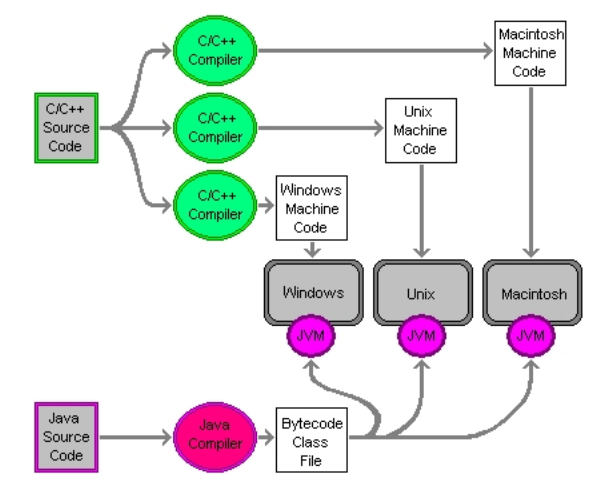

# CSC1103 Object Oriented Programming

## Notes!
1. Java source code file must have the exact same name as the class that is defined inside of it.
2. As in C and C++, Java run-time errors are more difficult to debug than compile-time errors.
3. Since Java programs are executed in a virtual machine (that is, the Java interpreter) run-time errors can be handled in a graceful way.
4. Two methods for translating a high-level programming language into machine language executables: compilation and interpretation.
5. C++ compiler can compile C source code files but not vice versa.
6. Java programs are compiled down to a platform-independent language called bytecode.
7. Bytecode is similar to machine language, but bytecode is not designed to run on any real, physical computer. Instead, bytecode is designed to be run by a program, called a Java virtual machine (JVM), which simulates a real machine.
8. JVM is an interpreter that translates Java bytecode into real machine language instructions that are executed on the underlying, physical machine.
9. Once a Java program is compiled down to bytecode, it can be run on any system that has a JVM.


## Compile and Run Java Program
* ```$ javac filename.java```
> to compile and generate a class file (Java bytecode executable)
* ```$ java filename```
> to run the executable class file in the Java interpreter (don't put .class extension)

## Java Integer Types
1. You can write Java integer values as octal or hexadecimal numbers using the same format as C/C++. Octals start with a 0 and hexadecimals start with a 0x
2. Java integers are always signed values. So, no signed or unsigned modifier like in C/C++.
3. Java long type (64 bits).
4. Java short type (16 bits).
5. Java byte type (8 bits).

## Java Boolean Type
1. C/C++ boolean data type is bool and their value is true, false, 1, or 0.
2. Java boolean data type is boolean and their value is true or false. (1 or 0 is illegal)
3. In Java programs, you cannot use int type values or expressions in place of boolean type values or expressions. For example, if you use an int in an if statement, which evaluates a boolean expression, the Java compiler will generate an error. This is a major change from C and C++, both of which use int values in logical expressions.